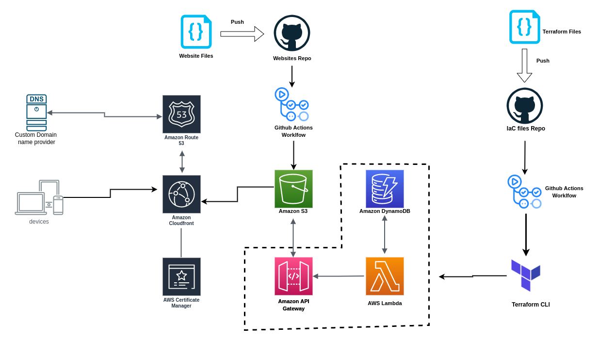

# infrastructure as code configuration files

The Cloud Resume Challenge is a hands-on project designed to help bridge the gap from cloud certification to cloud job. It incorporates many of the skills that real cloud and DevOps engineers use in their daily work. The Cloud Resume Challenge is a multiple-step (It's roughly 16 steps) resume project which helps build and demonstrate skills fundamental to pursuing a career as a Cloud Engineer.

### This is infrastructure files repo, The websites files is available at https://github.com/davWK/cloud-resume-challenge-AWS
